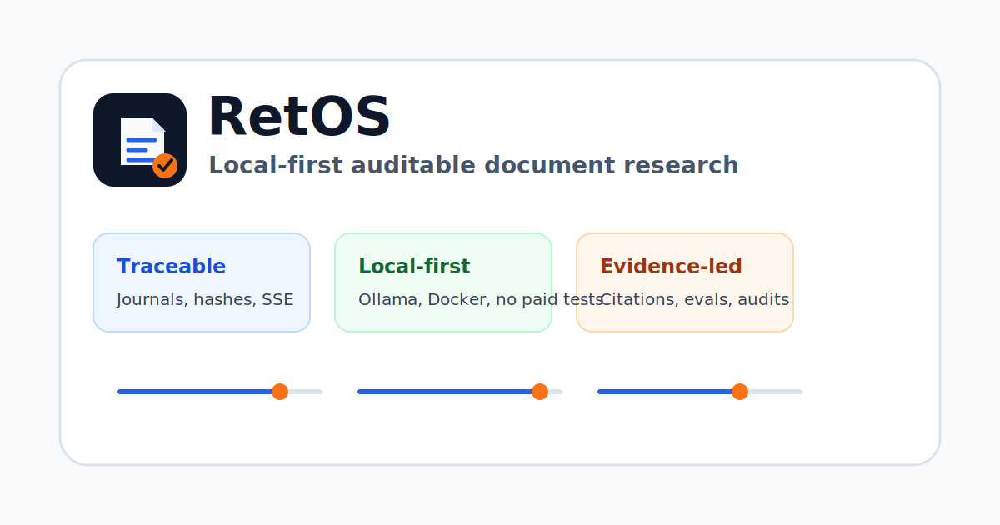

# RetOS



RetOS is a local-first research console for auditable document investigation. It runs as
a Docker stack with a React UI, FastAPI, Celery/RabbitMQ workers, Postgres, local OCR,
Tantivy BM25 search, Ollama `gemma4`, and a Deep Agents research runtime.

The short version: bring your documents, keep the canonical corpus versioned, rebuild
indexes when needed, and make every ingestion/query/eval step traceable.

[](https://github.com/nfernandezsanz/retOS/actions/workflows/ci.yml?query=branch%3Amain)
[](https://github.com/nfernandezsanz/retOS/actions/workflows/release.yml)
[](LICENSE)
[](#current-status)
[](#current-status)

**Action pills**

[](#local-quick-start)
[](#local-quick-start)
[](#local-audit-handoff)
[](#quality-gates)
[](docs/release-process.md)

## First Minute

| I want to... | Start here | What you get |
| --- | --- | --- |
| Run the product | [Local Quick Start](#local-quick-start) | Dockerized API, worker, web UI, Postgres, RabbitMQ, and local-safe defaults. |
| See useful data | [Demo corpus](#local-quick-start) | An auditable `retos-demo` domain, searchable documents, jobs, and journal events. |
| Trust the evidence | [Local Audit Handoff](#local-audit-handoff) | Manifest, Markdown handoff, checksum bundle, critical file hashes, and visual artifacts. |
| Judge readiness | [Current Status](#current-status) | Coverage, stability, cost posture, runtime posture, and production blockers. |
| Work with agents | [Development Model](#development-model) | The Codex/Claude-first loop for code, tests, docs, plans, and audit evidence. |

<details open>
<summary><strong>I want to try it locally</strong></summary>

```bash
make local-demo
make local-access
make local-status
make local-smoke
```

Open http://localhost:8080 for the console or http://localhost:8000/docs for the API.
`make local-access` prints the local URLs and the development bootstrap admin. It only
prints the password when it is still the obvious local placeholder; custom `.env`
passwords stay hidden.

</details>

<details>
<summary><strong>I want to audit it before trusting it</strong></summary>

```bash
make local-acceptance
make auditor-handoff-check
make audit-manifest-check
make audit-bundle-check
make calibration-scope-decision-check
make target-security-review-check
```

The offline manifest lands at `evals/reports/audit-manifest.json`, and the human-readable
summary lands at `evals/reports/audit-handoff.md`. The local auditor bundle lands at
`evals/reports/retos-audit-handoff.tar.gz` with a `.sha256` sidecar. Together they record
the current commit, dirty state, local gates, critical file hashes, visual artifacts, and
remaining production-promotion evidence.

</details>

<details>
<summary><strong>I want to develop with agents</strong></summary>

Start with `planning/`, `docs/adr/`, and the quality gates below. RetOS is intentionally
structured for mostly autonomous Codex/Claude implementation: every meaningful change
should update code, tests, docs, and the process tracker together.

</details>

## Why It Exists

RetOS is built for research workflows where "the answer" is not enough. Operators need
to see what was ingested, how it was indexed, what the agent read, which citations were
used, what jobs ran, and whether the audit journal still validates.

The project is intentionally designed as a staff-engineer-quality reference: local-first
runtime, written decisions, reproducible checks, no paid-provider calls in tests, and
auditor-friendly evidence.

## Local Quick Start

```bash
make local-demo
make local-access
make local-status
make local-smoke
```

Then open the console and API:

| Action | Local URL |
| --- | --- |
| Use the React console | http://localhost:8080 |
| Inspect the API | http://localhost:8000/docs |
| Check API health | http://localhost:8000/healthz |
| Check API readiness | http://localhost:8000/readyz |
| Check runtime metadata | http://localhost:8000/versionz |
| Watch RabbitMQ | http://localhost:15672 |

`make local-demo` is the fastest local path: it runs `make bootstrap-env`, `make doctor`,
starts the API, worker, web, Postgres, RabbitMQ, and migration services in the
background, seeds the demo corpus, and prints the useful URLs. It does not pull the
optional Ollama image; use the model command below only when you want local LLM calls.
Use `make docker-down` when you are done.

Run `make local-status` any time after startup to print the useful URLs, inspect the
Docker services, confirm the one-shot migration container when Compose exposes it, and
verify the console/API endpoints from your machine. It also checks that the API, worker,
and migration roles are running the same backend image digest, so image drift is visible
before deeper Docker smoke runs.

Run `make local-access` when you need the local URLs and safe development login hints
again. It reads `.env` when present, falls back to `.env.example`, and never echoes a
custom bootstrap admin password.

Run `make local-smoke` when you want a fast end-to-end check against the already-running
stack: it loads the web console, checks API readiness/version metadata, logs in with the
local bootstrap admin, re-seeds the demo corpus idempotently, and verifies demo search
returns indexed evidence plus journal/progress hash-chain events, authenticated SSE
progress replay/resume, and a valid limited audit export rechecked by the offline
audit-export verifier.

For manual control, run `make bootstrap-env`, `make doctor`, `docker compose up --build`,
then `make docker-seed-demo` in another shell.

`make docker-seed-demo` runs inside the API container, creates or reuses a `retos-demo`
domain, ingests three local text documents through normal auditable jobs, rebuilds the
BM25 index, and leaves searchable data visible in the console. Try searching for
`Apollo guidance`, `plankton salinity`, or `incident retention`. You can do the same from
the React console with the **Seed local corpus** action on Overview or the **Seed demo**
button in Documents; both call the admin-only `/demo/seed` endpoint and are disabled in
production mode.

Pull the default local model when you want Ollama-backed runs:

```bash
docker compose --profile models run --rm ollama-pull
```

Local defaults are intentionally cheap: `RETOS_PROVIDER=local`,
`RETOS_OLLAMA_MODEL=gemma4`, and `RETOS_ALLOW_PAID_LLM=false`.
`make bootstrap-env` is idempotent: it creates `.env` from `.env.example` when missing
and leaves an existing local `.env` untouched.

## Local Troubleshooting

| Symptom | Local check | What to do |
| --- | --- | --- |
| The console does not load | `make local-status` | Confirm `web`, `api`, Postgres, RabbitMQ, migrations, the shared backend runtime image digest, and host endpoints are reachable; rerun `make local-demo` if a required service is missing. |
| API readiness is failing | `curl --fail http://localhost:8000/readyz` | Run `make local-logs` and rerun `make doctor` before changing code or secrets. |
| Demo data is missing | `make docker-seed-demo` | Re-seed the idempotent demo corpus, then refresh Documents or run `make local-status` to confirm the stack stayed healthy. |
| Search or demo flow feels broken | `make local-smoke` | Exercise login, idempotent demo seeding, indexed search, API readiness/version, journal/progress hash-chain evidence, SSE replay/resume, limited audit export integrity with offline verifier recomputation, and the web console against the running stack. |
| A command would use paid providers | `make env-security-check` | Keep `RETOS_ALLOW_PAID_LLM=false` for local tests; paid provider calls require explicit opt-in and complete provider configuration. |
| The UI looks wrong after edits | `make frontend-e2e && make frontend-visual-audit && make visual-audit-check` | Rebuild browser evidence locally and inspect the generated visual-audit screenshots before touching CI. |
| You want to stop everything | `make docker-down` | Stops the Compose stack without deleting source code, docs, or committed evidence. |

## Local Audit Handoff

For a local, auditor-friendly snapshot that does not depend on GitHub Actions:

```bash
make auditor-handoff-check
```

That command runs the static auditor gates, writes an offline manifest to
`evals/reports/audit-manifest.json`, and writes a human-readable summary to
`evals/reports/audit-handoff.md`. It also writes
`evals/reports/retos-audit-handoff.tar.gz` plus a `.sha256` checksum sidecar with the
manifest, report, production readiness pack, release process, operations guide, branding
guide, release note, calibration evidence, calibration trend evidence, calibration scope
decision template, promotion template, and CI/release workflows. The Markdown handoff includes a promotion decision
checklist that separates locally proven evidence from external release and
target-environment decisions. These artifacts deliberately do not claim production
promotion.

For the human target-environment security review, validate the template with
`make target-security-review-check`, then complete
`docs/releases/evidence/target-security-review-template.md` and store the completed copy
with the promotion record.

For the human visual review, validate the template with `make visual-review-check`, then
complete `docs/releases/evidence/visual-review-template.md` after reviewing the
desktop/mobile visual audit PNGs and store the completed copy with the promotion record.

For bounded public calibration slices, validate the decision template with
`make calibration-scope-decision-check`, then complete
`docs/releases/evidence/calibration-scope-decision-template.md` to record whether the
pilot scope is accepted or broader trend evidence is attached.

Remote CI evidence is separate:

```bash
make ci-status-check
```

Use that only when you want to verify the latest GitHub Actions run and its downloadable
backend-coverage, visual-audit, audit-manifest, and audit-handoff artifacts.

## Where To Look

| Need | Start Here |
| --- | --- |
| Run the stack | [docs/docker.md](docs/docker.md) |
| Operate, backup, restore, rollback | [docs/operations.md](docs/operations.md) |
| Prepare a release | [docs/release-process.md](docs/release-process.md) |
| Review production readiness | [docs/production-readiness.md](docs/production-readiness.md) |
| Map requirements to evidence | [docs/auditor-evidence-matrix.md](docs/auditor-evidence-matrix.md) |
| Read project changes | [CHANGELOG.md](CHANGELOG.md) |
| Query/API examples | [docs/api-integration.md](docs/api-integration.md) |
| Eval strategy | [docs/evals.md](docs/evals.md) |
| Data model and migrations | [docs/database.md](docs/database.md) |
| Security reporting | [SECURITY.md](SECURITY.md) |
| Brand and UI contract | [docs/branding.md](docs/branding.md) |
| Roadmap and phase tracker | [planning/](planning/) |

## Current Status

| Signal | Status |
| --- | --- |
| Product maturity | Pre-alpha foundation; core product slices are being built phase by phase. |
| Backend coverage | 95.42% total coverage; 90.75% branch-only coverage is enforced by the 90.65% ratchet above the 90% target. |
| Local runtime | Docker-first stack with Postgres, RabbitMQ, Ollama, API, worker, and web UI. |
| Cost posture | Zero paid LLM calls by default; paid providers require explicit opt-in. |
| Production status | Not production-promoted; final release still needs GHCR digests, SBOM/provenance, Cosign evidence, and human target-environment review. |

## What You Can Do Today

| Workflow | Local Action |
| --- | --- |
| Navigate the console | Use the compact Overview with runtime build/readiness metadata, seed the bundled demo corpus when needed, then switch to Documents, Queries, Evals, Audit, or Admin; each long screen has module pills and a current-context band for its main task areas |
| Manage domains and sources | Use compact context cards to confirm active domain, visible document/archive scope, registered source count, and local rebuild posture; create domains, edit/archive/restore domain details, create/edit/remove sources, scan mounted sources, and rebuild indexes from the React console at http://localhost:8080 |
| Upload and manage documents | Upload files, paste text, inspect evidence, rename documents, archive/restore, and review document history in the React console |
| Watch ingestion/indexing | Live job/progress views and SSE-backed updates in the UI |
| Query with citations | Run grounded agent queries against indexed domains |
| Inspect audit state | Export `/audit/export` and validate hash-chain fields |
| Run deterministic evals | `make eval-smoke` and `make eval-agent-multihop` |
| Smoke the full stack | `make docker-smoke` |
| Prepare human review | `make auditor-handoff-check` |
| Prepare calibration decision | `make calibration-scope-decision-check` |
| Prepare target security review | `make target-security-review-check` |

## What This Repository Contains

<details>
<summary>Implemented capabilities</summary>

- A Python 3.14 FastAPI backend scaffold with secure settings, JWT helpers, Argon2 password hashing, persisted-resume SSE progress streaming, and Celery/RabbitMQ wiring.
- Initial SQLAlchemy async persistence for domain and source management through a Unit of Work.
- Domain management API and UI for creating research domains, selecting the active
  workspace, updating domain name/description, and archiving/restoring domains without
  deleting corpus evidence, with auditable `domain.updated`, `domain.archived`, and
  `domain.restored` journal events.
- Source management API and UI for creating sources, updating source kind/name/URI, and
  removing sources without deleting already-ingested documents, with auditable
  `source.updated` and `source.deleted` journal events.
- Alembic migrations for domains, sources, documents, versions, artifacts, segments, jobs, progress events, and audit journals.
- Persisted admin users with idempotent bootstrap at startup, active-account and
  persisted-role token checks, audited account creation/status/role updates,
  password resets, and a read-only `viewer` role with per-domain grants for
  operational visibility.
- Durable documents API with immutable initial versions, auditable title/metadata updates,
  soft archive/restore, field-level history, progress events, and live SSE notifications.
- Durable artifact and segment APIs for OCR outputs, page-level OCR text artifacts, rebuildable projections, retrieval chunks, and citation anchors.
- Durable jobs API with persisted lifecycle transitions, journal records, progress-event records, and live SSE notifications.
- Persisted audit hash-chain fields for journal/progress events, with export validation for durable ledger review.
- Text ingestion API and Celery worker path that hashes inline text, creates document/version/artifact/segment records, and emits auditable progress.
- File upload ingestion API and React flow for `.txt`, `.md`, and `.pdf` documents, with sanitized basenames, declared MIME/extension validation, persisted upload `content_type` evidence, and shared storage so the API and worker process the same uploaded bytes from the same backend image/runtime.
- Mounted source scanner for `.txt`, `.md`, digital `.pdf`, and OCR fallback for image-only PDFs with idempotent duplicate-hash skips, extracted-text artifacts, page-level OCR text artifacts, deterministic segments, and scan progress.
- Tantivy BM25 search adapter with durable `index.domain` jobs, rebuildable domain indexes, searchable segments, and citation anchors.
- LLM provider catalog API with local Ollama `gemma4` as the default profile, paid providers blocked unless explicitly enabled, safe missing-configuration hints, non-secret runtime switch plans for provider/runtime env changes, and runtime fail-fast validation for selected provider profiles.
- Auditable `agent.query` jobs that use controlled corpus search/read tools, execute bounded multi-hop subqueries, persist grounded answers, citations, deterministic query plans, evidence-route coverage, deterministic multi-hop audit status with bridge terms, bounded neighboring context, and budget usage, and emit journal/progress events.
- Deterministic local eval smoke for retrieval recall, citation validity, grounded answers, abstention, and budget compliance, with report provenance metadata persisted for audits.
- Deterministic agent multi-hop evals for query planning, bounded subquery execution, evidence-route coverage, bridge terms, citations, grounding, and budgets, without provider calls.
- Opt-in HotpotQA-to-agent evals that convert local supporting-fact cases into
  multi-hop agent audit cases for query-plan, evidence-route, bridge-term, grounding,
  citation, and budget calibration through CLI, admin API, rerun, and React controls.
- Opt-in SQuAD 2.0, HotpotQA, and Natural Questions adapters plus API endpoints
  for local dataset-backed evals without network or paid providers, with optional
  JSON/Markdown report export and viewer-safe domain-scoped execution.
- Opt-in OCR quality smoke suite for scanned PDFs, character error rate, and word error rate.
- Cross-run eval comparison, trend, gate, and rerun APIs with React controls for latest
  reported runs, domain-scoped viewer history/trends/comparison/regression gates/reruns,
  per-metric deltas, suite trend direction, and auditable `rerun_from_job_id`
  traceability.
- A React + TypeScript + Vite frontend scaffold focused on operational visibility for
  a compact Overview plus hash-addressable Documents, Queries, Evals, Audit, and Admin
  sections, runtime build metadata from `/versionz`, readiness from `/readyz`, plus contextual module pills and current-context bands that shorten
  Documents, Queries, Evals, Audit, and Admin into scan-friendly task areas. The UI includes hover/focus tooltips,
  compact responsive panels, sticky module headers, bounded long lists, compact module scroll regions, domain detail editing/archive/restore, source detail editing/removal, document inventory, edit/archive/restore/history actions, jobs,
  OCR, indexing, agent runs, local eval execution, and admin account management.
- Docker Compose for Postgres, RabbitMQ, Ollama, web, and one shared backend image reused by API, worker, and migrations through role-specific commands.
- Planning, ADRs, and architecture assets for the open source implementation path.
- Branding assets and visual guidance for a coherent audit-console identity.
- Test and coverage defaults that avoid paid LLM calls.
- CI jobs that validate backend and root Python script format/PEP 8, types, tests, API smoke, frontend build, browser smoke, Docker build, and Docker stack smoke.
- Release workflow for GHCR image publishing with SBOM/provenance attestations, Cosign
  signing, and signature verification for `retos-backend` and `retos-web`.

</details>

## Development Model

<details>
<summary>How autonomous development is expected to work</summary>

RetOS is designed to be developed primarily with autonomous coding agents such as Codex and Claude, with limited human interaction and strong written constraints. The repository is structured so agents can work from durable artifacts instead of relying on ad hoc chat memory:

- `planning/` defines the roadmap, phase gates, testing policy, UI plan, auditability model, and implementation decisions.
- `docs/adr/` records architectural decisions before they sprawl through the codebase.
- `README.md`, `docs/docker.md`, and `CONTRIBUTING.md` describe how to build, test, run, and validate the system.
- CI is expected to catch formatting, PEP 8, type, coverage, API, frontend, and browser regressions, including root Python audit/release scripts.
- Agents should update plans, tests, docs, and ADRs in the same change when behavior or architecture changes.

The intended loop is:

```text
read planning and ADRs
  -> implement the smallest coherent slice
  -> run Black continuously
  -> run unit, integration, API smoke, and browser smoke checks
  -> update docs and tracker
  -> commit with a clear message
```

</details>

## Architecture


```text
documents/uploads/mounts
  -> versioned corpus store
  -> reproducible ingest pipeline
  -> Tantivy BM25 + metadata indexes
  -> Deep Agents research runtime
  -> cited answer + evidence ledger + audit journal
```

## Stack

| Area | Choice |
| --- | --- |
| Backend | Python 3.14, FastAPI, Pydantic v2, SQLAlchemy 2 async, Alembic |
| Queue | Celery with RabbitMQ |
| Database | Postgres |
| Search | Tantivy via adapter |
| OCR | Local OCR pipeline with PyMuPDF, Tesseract, and pytesseract |
| Agent runtime | Deep Agents |
| Local LLM | Ollama with `gemma4` |
| Frontend | React 19, TypeScript, Vite, TanStack Query, TanStack Router |
| Streaming | Server-Sent Events |
| License | MIT |

## Development

Install backend dependencies:

```bash
python3 -m pip install -r backend/requirements-dev.txt
```

Run backend checks:

```bash
make format-check
make lint
make typecheck
make test
make eval-smoke
make eval-fetch-dataset PROFILE=squad-dev-v2 MAX_RECORDS=100
make eval-fetch-dataset PROFILE=nq-simplified-local SOURCE_PATH=/path/to/simplified-nq-dev-all.jsonl.gz MAX_RECORDS=100
make eval-ocr
make eval-squad SQUAD_PATH=evals/datasets/dev-v2.0.json MAX_CASES=50 REPORT_DIR=evals/reports
make eval-hotpotqa HOTPOTQA_PATH=evals/datasets/hotpot_dev_distractor_v1.json MAX_CASES=50 REPORT_DIR=evals/reports
make eval-hotpotqa-agent HOTPOTQA_PATH=evals/datasets/hotpot_dev_distractor_v1.json MAX_CASES=50 REPORT_DIR=evals/reports
make eval-natural-questions NQ_PATH=evals/datasets/nq-dev-sample.jsonl MAX_CASES=50 REPORT_DIR=evals/reports
make api-smoke
```

Apply local database migrations:

```bash
make db-upgrade
```

Format backend code while working:

```bash
make format
```

Install and check the frontend:

```bash
cd frontend
npm install
npm run check
npm run e2e
```

Run the full local validation loop:

```bash
make local-acceptance
```

The expanded command sequence behind that gate is:

```bash
make doctor
make check
make integration
make frontend-test
make frontend-e2e
make frontend-visual-audit
docker compose --env-file .env.example config
docker compose --dry-run build
make release-check
make production-preflight
make dependency-audit
make auditor-handoff-check
make audit-manifest-check
make release-notes-check
make versioned-release-notes-check
make docker-smoke
```

When you need remote repository evidence for a release commit, run
`make ci-status-check` separately.

## Quality Gates

Every meaningful change should pass these gates:

| Gate | Command | Purpose |
| --- | --- | --- |
| Local demo | `make local-demo` | Boots the local Docker stack in the background, seeds auditable demo data, and prints the console/API/RabbitMQ URLs for hands-on review. |
| Local access | `make local-access` | Prints local URLs plus the bootstrap admin email and only the development placeholder password; custom `.env` passwords are acknowledged without being echoed. |
| Local status | `make local-status` | Prints useful local URLs, checks Docker service and migration state, verifies API/worker/migrate share one backend image digest, and checks console/API endpoints without starting or mutating the stack. |
| Local smoke | `make local-smoke` | Hits the already-running local web/API stack, authenticates with the bootstrap admin, re-seeds demo data idempotently, and verifies demo search plus journal/progress hash-chain, authenticated SSE replay/resume, and limited audit export evidence with offline verifier recomputation. |
| Local logs | `make local-logs` | Prints recent Compose logs for Postgres, RabbitMQ, migrations, API, worker, and web without following or mutating the stack. |
| Local doctor | `make doctor` | Checks local prerequisites, safe `.env.example` defaults, the active `.env` when present, Docker Compose config, topology guard, and audit-export verifier before heavier gates. |
| Environment security | `make env-security-check` | Validates the active `.env` without starting services; missing local `.env` warns, while unsafe production placeholders, wildcard CORS outside development, invalid providers, paid-provider opt-in drift, and short secrets fail. |
| Demo corpus seed | `make docker-seed-demo` or `make seed-demo SEED_DEMO_ARGS=--create-schema` | Seeds an idempotent, auditable demo domain with text-ingestion jobs, hash-chained journal/progress events, and a rebuilt local BM25 index for hands-on UI checks. |
| Python format | `make format-check` | Enforces Black formatting for backend code and root Python audit/release scripts. |
| Python PEP 8/lint | `make lint` | Uses Ruff for PEP 8 and bug-prone patterns across backend code and root Python scripts. |
| Backend types | `make typecheck` | Enforces strict mypy on `src`. |
| Backend tests | `make test` | Runs pytest with the 90% total coverage gate and an explicit branch coverage ratchet from `coverage.json` (`BRANCH_COVERAGE_MIN`, currently 90.65%). |
| Dependency audit | `make dependency-audit` | Runs `pip-audit` against backend runtime requirements and `npm audit --audit-level=high` against the frontend lockfile. |
| Security policy | `make security-policy-check` | Validates security reporting, secure defaults, human production review guidance, and links from operational docs. |
| Ignore hygiene | `make ignore-hygiene-check` | Validates `.gitignore` and `.dockerignore` keep secrets, generated files, local volumes, public datasets, reports, and backups out of Git and Docker contexts. |
| Operations runbook | `make operations-runbook-check` | Validates backup, restore, rollback, health-check, audit-export, and promotion-evidence fields. |
| Visual review template | `make visual-review-check` | Validates the human visual acceptance evidence template for screenshot hashes, desktop/mobile review, workflow coverage, overflow, tooltips, findings, and decision fields. |
| Backup/restore drill template | `make backup-restore-drill-check` | Validates the detailed backup/restore rehearsal evidence template for backup artifacts, restore commands, health checks, audit-export verification, and promotion impact. |
| Promotion template | `make promotion-template-check` | Validates the human promotion evidence template contract: required sections, local gates, release provenance, visual/security review, backup/restore rehearsal, rollback, and decision fields. |
| Auditor evidence matrix | `make auditor-evidence-matrix-check` | Validates the objective-to-evidence matrix so requirements, local gates, and external promotion blockers stay traceable. |
| README usability | `make readme-check` | Validates that onboarding pills, first-minute paths, current status, local actions, and the Codex/Claude development model stay visible for new reviewers. |
| Auditor static pack | `make auditor-static-check` | Runs the non-destructive auditor gates for dependency advisories, security policy, ignore hygiene, operations runbooks, branding, CI/release workflow contracts, release notes, production preflight, and audit-pack alignment. |
| Auditor handoff | `make auditor-handoff-check` | Runs the local static auditor pack and exports the offline manifest, Markdown handoff with promotion decision checklist, and checksummed bundle under `evals/reports/`. |
| Audit handoff manifest | `make audit-manifest OUTPUT=evals/reports/audit-manifest.json` | Exports commit state, generation context, coverage evidence from `backend/coverage.json`, required gates, critical file hashes including the auditor evidence matrix and branding assets, visual audit screenshot records, and remaining external promotion evidence as JSON. |
| Audit manifest schema | `make audit-manifest-check` | Validates the audit manifest schema, required gates, critical file hashes, visual artifact names, and external blockers offline. |
| Audit handoff report | `make audit-handoff-report MANIFEST=evals/reports/audit-manifest.json OUTPUT=evals/reports/audit-handoff.md` | Exports a human-readable Markdown companion with candidate, verdict, evidence-status table, coverage source, local gates, blockers, promotion decision checklist, hashes, and visual evidence. |
| Audit handoff report schema | `make audit-handoff-report-check` | Validates that the generated Markdown report preserves the key manifest evidence. |
| Audit handoff bundle | `make audit-bundle OUTPUT=evals/reports/retos-audit-handoff.tar.gz AUDIT_MANIFEST_SKIP_CI=true` | Exports a tarball plus `.sha256` checksum with the JSON manifest, Markdown handoff, production readiness docs, release docs, calibration evidence, operations docs, branding contract, and workflows. |
| Audit handoff bundle schema | `make audit-bundle-check` | Validates the generated tarball members and checksum offline. |
| Eval smoke | `make eval-smoke` | Runs deterministic local retrieval, citation, grounding, abstention, and budget scorers without network or paid providers. |
| Agent multi-hop eval | `make eval-agent-multihop` | Runs deterministic query-plan, multi-hop audit, evidence-route, citation, grounding, and budget scorers without network or paid providers. |
| Local acceptance | `make local-acceptance` | Runs the local pre-audit acceptance gate across backend, API, frontend, visual audit, Docker config, auditor handoff, and Docker smoke. |
| Dataset fetch | `make eval-fetch-dataset PROFILE=squad-dev-v2` | Opt-in download or local sampling of bounded public dataset samples under `evals/datasets`; records the effective `source_url`, supports retryable mirrors, and never runs in CI by default. |
| Real-dataset calibration | `make eval-calibration MAX_RECORDS=200 MAX_CASES=40 METRIC_GATES="retrieval_recall=0.80 citation_validity=1.0"` | Opt-in multi-suite public dataset calibration for SQuAD, HotpotQA, HotpotQA-agent, and NQ-Open adapter samples; writes JSON/Markdown reports plus a metric-gated manifest under `evals/reports/calibration`. |
| Calibration evidence | `make eval-calibration-evidence OUTPUT=docs/releases/evidence/<release>-calibration.md` | Converts the ignored calibration manifest into path-safe Markdown evidence with metrics, gates, source URLs, records, and license notes. |
| Calibration evidence gate | `make eval-calibration-gate` | Validates versioned calibration evidence offline: PASS status, required targets, minimum records/cases, required metric gates, HTTPS source URLs, and no local dataset/report path leakage. |
| Calibration trend gate | `make eval-calibration-trend-gate` | Validates versioned trend evidence offline: PASS status, baseline/candidate sample growth, required targets, HTTPS source URLs, metric-level regression tolerance, and no local dataset/report path leakage. |
| Calibration scope decision | `make calibration-scope-decision-check` | Validates the human decision template for accepting the bounded pilot scope or attaching broader public-slice trend evidence. |
| OCR eval | `make eval-ocr` | Runs opt-in local OCR quality checks over generated image-only PDFs with CER/WER scoring. |
| SQuAD eval | `make eval-squad SQUAD_PATH=...` | Runs opt-in SQuAD 2.0 local evals from a user-provided dataset file and can write JSON/Markdown reports. |
| HotpotQA eval | `make eval-hotpotqa HOTPOTQA_PATH=...` | Runs opt-in HotpotQA multi-hop evals from a user-provided dataset file and can write JSON/Markdown reports. |
| HotpotQA agent eval | `make eval-hotpotqa-agent HOTPOTQA_PATH=...` | Converts local HotpotQA supporting facts into agent audit cases for multi-hop plan, evidence-route, bridge-term, grounding, citation, and budget calibration. |
| Natural Questions eval | `make eval-natural-questions NQ_PATH=...` | Runs opt-in Natural Questions real-query evals from a user-provided JSONL/JSON dataset file and can write JSON/Markdown reports. |
| API smoke | `make api-smoke` | Starts Uvicorn and hits health, auth, demo corpus seed/search, admin user management, domain/source/document update/archive/restore/history/artifact/segment CRUD, mounted source scan, text/file upload ingestion queueing, BM25 rebuild/search, agent multi-hop/SQuAD/HotpotQA/HotpotQA-agent/Natural Questions evals, eval rerun/comparison/trends, generic eval job retry, job lifecycle, audit export, and SSE over HTTP. OCR benchmark API smoke is opt-in for Docker where Tesseract is present. |
| Frontend build | `make frontend-test` | TypeScript build plus Vite production build. |
| Browser smoke | `make frontend-e2e` | Opens the React console with Playwright and verifies section navigation, tooltip contract, compact module height limits, runtime build/readiness metadata, contextual module pills, current-context bands, visible UI state, admin user management, document edit/archive/restore/history, agent multi-hop and dataset-backed evals, eval rerun, eval comparison, and eval trend flows. |
| Visual audit screenshots | `make frontend-visual-audit` | Generates ignored desktop/mobile PNG snapshots and `frontend/visual-audit/manifest.json` with viewport, size, SHA-256 metadata, section-navigation evidence, and responsive no-overflow coverage; CI uploads them as a `retos-visual-audit-<commit>` artifact. |
| Visual audit evidence gate | `make visual-audit-check` | Validates the local visual-audit manifest offline, including expected desktop/mobile screenshot records, PNG existence, byte sizes, SHA-256 hashes, and viewport dimensions. |
| Compose config | `docker compose --env-file .env.example config` | Validates the Docker stack definition. |
| Image dry run | `docker compose --dry-run build` | Validates image build graph without requiring a running daemon. |
| Release readiness | `make release-check` | Validates release docs, Docker image topology, safe defaults, operations runbook coverage, and a dry-run of the published evidence verifier. |
| Production audit pack | `make audit-pack-check` | Validates that production readiness evidence, blockers, and auditor links stay current. |
| Production preflight | `make production-preflight` | Validates local evidence, branding, release docs, and external release blockers are aligned for human review. |
| Brand contract | `make brand-check` | Validates the project card, favicon mark, palette, branding guide, README visibility, and Playwright brand smoke coverage. |
| CI workflow | `make ci-workflow-check` | Validates GitHub Actions CI jobs, local gates, root Python script checks, evidence artifacts, and audit handoff export steps offline. |
| Current HEAD CI | `make ci-status-check` | Queries GitHub Actions and verifies the current commit has successful backend, frontend, docker, final audit-evidence jobs, and required backend-coverage/visual-audit/audit-manifest/audit-handoff artifacts. |
| Release notes | `make release-notes-check` | Validates changelog, release-process guidance, and docs links for auditable releases. |
| Versioned release notes | `make versioned-release-notes-check` | Validates concrete release note artifacts with evidence, limits, and rollback details. |
| Release workflow | `make release-workflow-check` | Validates GHCR publishing, SBOM/provenance, Cosign signing, and signature verification workflow documentation. |
| Published release evidence | `make release-evidence-check` | Verifies immutable GHCR backend/web digests with Cosign after a release workflow run supplies `VERSION`, `BACKEND_DIGEST`, and `WEB_DIGEST`. |
| Backend runtime image | `make docker-runtime-image-check` | Verifies running API, worker, and migration containers use the exact same backend Docker image ID. |
| Docker stack smoke | `make docker-smoke` | Builds the shared backend image plus web image, verifies API/worker/migrate share one runtime image ID, runs migrations, starts Postgres/RabbitMQ/API/worker/web, creates a mounted `.txt`/`.md`/`.pdf` fixture corpus, and hits health, auth, admin user management, domain/source/document update/archive/restore/history/artifact/segment CRUD, worker-backed source scan, worker-backed text and file upload ingestion, worker-backed BM25 rebuild/search, SQuAD/HotpotQA/Natural Questions/OCR benchmark evals, eval run comparison, job lifecycle, SSE, and web over HTTP. |

## Security Defaults

- Paid providers are disabled by default with `RETOS_ALLOW_PAID_LLM=false`.
- The production JWT secret must be at least 32 characters and must not use the development placeholder.
- A default bootstrap admin password is allowed only in development and is materialized as a persisted admin user at startup; custom bootstrap passwords must be at least 12 characters.
- Passwords are hashed with Argon2 through `pwdlib`.
- JWTs include issuer, audience, issue time, not-before time, and expiration.
- CORS is explicit; wildcard origins are rejected outside development.
- RabbitMQ carries job commands and IDs only; Celery task results are ignored by default. Documents, artifacts, and durable job state stay in Postgres-backed metadata and storage volumes.

## Repository Layout

```text
backend/      FastAPI API, Celery worker, domain-facing services, tests
frontend/     React console
docs/         ADRs and architecture assets
infra/        Docker entrypoints and runtime config
planning/     Implementation plan and phase tracker
evals/        Local evaluation reports and optional dataset caches
```

## Project Status

The foundation is in place and CI should remain green before feature work proceeds. The project is not product-complete yet; it is a deliberately staged implementation and is not production-promoted. The current milestone is Phase 5: keep the 200-record/40-case bounded real-dataset calibration green, expand trend evidence across larger public slices, continue UI hardening, and collect release promotion evidence. Human promotion review should start from [docs/production-readiness.md](docs/production-readiness.md).
