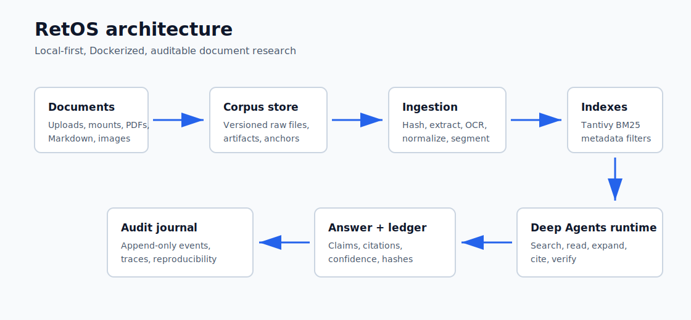

# RetOS

RetOS is a local-first research system for auditable document investigation. It is designed to run as a reusable Docker stack with a React console, a FastAPI backend, Celery workers backed by RabbitMQ, Postgres persistence, Tantivy BM25 search, local OCR, and a Deep Agents research runtime.

The source of truth is the versioned corpus store. Search indexes are rebuildable projections, not the canonical record.

## Current Status

| Signal | Status |
| --- | --- |
| Product maturity | Pre-alpha foundation. Core product slices are being built phase by phase. |
| Backend coverage | 90.52% line/branch coverage on the current scaffold. |
| Stability | Green foundation: format, PEP 8, typecheck, tests, eval smoke, API smoke, frontend build, browser smoke, Docker build, migrations, and Docker stack smoke are enforced. |
| Default cost profile | Zero paid LLM calls. Paid providers are disabled unless explicitly enabled. |
| Runtime model | Docker-first local stack with Postgres, RabbitMQ, Ollama, API, worker, and web UI. |
| Next milestone | Phase 5: larger real-dataset trend calibration, UI hardening, and release promotion evidence. |

This repository is intentionally being built as a staff-engineer-quality reference project: decisions are documented, quality gates are automated, integration checks hit real endpoints, UI smoke tests open the actual frontend, and every implementation phase is expected to leave behind tests, auditability, and operating notes.

## What This Repository Contains

- A Python 3.14 FastAPI backend scaffold with secure settings, JWT helpers, Argon2 password hashing, persisted-resume SSE progress streaming, and Celery/RabbitMQ wiring.
- Initial SQLAlchemy async persistence for domain and source management through a Unit of Work.
- Alembic migrations for domains, sources, documents, versions, artifacts, segments, jobs, progress events, and audit journals.
- Persisted admin users with idempotent bootstrap at startup, active-account and
  persisted-role token checks, audited account creation/status/role updates,
  password resets, and a read-only `viewer` role with per-domain grants for
  operational visibility.
- Durable documents API with immutable initial versions, auditable title/metadata updates,
  soft archive/restore, field-level history, progress events, and live SSE notifications.
- Durable artifact and segment APIs for OCR outputs, page-level OCR text artifacts, rebuildable projections, retrieval chunks, and citation anchors.
- Durable jobs API with persisted lifecycle transitions, journal records, progress-event records, and live SSE notifications.
- Persisted audit hash-chain fields for journal/progress events, with export validation for durable ledger review.
- Text ingestion API and Celery worker path that hashes inline text, creates document/version/artifact/segment records, and emits auditable progress.
- File upload ingestion API and React flow for `.txt`, `.md`, and `.pdf` documents, using shared storage so the API and worker process the same uploaded bytes from the same backend image/runtime.
- Mounted source scanner for `.txt`, `.md`, digital `.pdf`, and OCR fallback for image-only PDFs with idempotent duplicate-hash skips, extracted-text artifacts, page-level OCR text artifacts, deterministic segments, and scan progress.
- Tantivy BM25 search adapter with durable `index.domain` jobs, rebuildable domain indexes, searchable segments, and citation anchors.
- LLM provider catalog API with local Ollama `gemma4` as the default profile, paid providers blocked unless explicitly enabled, safe missing-configuration hints, and runtime fail-fast validation for selected provider profiles.
- Auditable `agent.query` jobs that use controlled corpus search/read tools, execute bounded multi-hop subqueries, persist grounded answers, citations, deterministic query plans, evidence-route coverage, deterministic multi-hop audit status with bridge terms, bounded neighboring context, and budget usage, and emit journal/progress events.
- Deterministic local eval smoke for retrieval recall, citation validity, grounded answers, abstention, and budget compliance, with report provenance metadata persisted for audits.
- Deterministic agent multi-hop evals for query planning, bounded subquery execution, evidence-route coverage, bridge terms, citations, grounding, and budgets, without provider calls.
- Opt-in HotpotQA-to-agent evals that convert local supporting-fact cases into
  multi-hop agent audit cases for query-plan, evidence-route, bridge-term, grounding,
  citation, and budget calibration through CLI, admin API, rerun, and React controls.
- Opt-in SQuAD 2.0, HotpotQA, and Natural Questions adapters plus admin API endpoints
  for local dataset-backed evals without network or paid providers, with optional
  JSON/Markdown report export.
- Opt-in OCR quality smoke suite for scanned PDFs, character error rate, and word error rate.
- Cross-run eval comparison, trend, and rerun APIs with React controls for latest
  reported runs, per-metric deltas, suite trend direction, and auditable
  `rerun_from_job_id` traceability.
- A React + TypeScript + Vite frontend scaffold focused on operational visibility for
  document inventory, edit/archive/restore/history actions, jobs, OCR, indexing, agent
  runs, local eval execution, and admin account management.
- Docker Compose for Postgres, RabbitMQ, Ollama, web, and one shared backend image reused by API, worker, and migrations through role-specific commands.
- Planning, ADRs, and architecture assets for the open source implementation path.
- Test and coverage defaults that avoid paid LLM calls.
- CI jobs that validate backend format, PEP 8, types, tests, API smoke, frontend build, browser smoke, Docker build, and Docker stack smoke.
- Release workflow for GHCR image publishing with SBOM/provenance attestations and Cosign
  signing for `retos-backend` and `retos-web`.

## Development Model

RetOS is designed to be developed primarily with autonomous coding agents such as Codex and Claude, with limited human interaction and strong written constraints. The repository is structured so agents can work from durable artifacts instead of relying on ad hoc chat memory:

- `planning/` defines the roadmap, phase gates, testing policy, UI plan, auditability model, and implementation decisions.
- `docs/adr/` records architectural decisions before they sprawl through the codebase.
- `README.md`, `docs/docker.md`, and `CONTRIBUTING.md` describe how to build, test, run, and validate the system.
- CI is expected to catch formatting, PEP 8, type, coverage, API, frontend, and browser regressions.
- Agents should update plans, tests, docs, and ADRs in the same change when behavior or architecture changes.

The intended loop is:

```text
read planning and ADRs
  -> implement the smallest coherent slice
  -> run Black continuously
  -> run unit, integration, API smoke, and browser smoke checks
  -> update docs and tracker
  -> commit with a clear message
```

## Architecture



```text
documents/uploads/mounts
  -> versioned corpus store
  -> reproducible ingest pipeline
  -> Tantivy BM25 + metadata indexes
  -> Deep Agents research runtime
  -> cited answer + evidence ledger + audit journal
```

## Stack

| Area | Choice |
| --- | --- |
| Backend | Python 3.14, FastAPI, Pydantic v2, SQLAlchemy 2 async, Alembic |
| Queue | Celery with RabbitMQ |
| Database | Postgres |
| Search | Tantivy via adapter |
| OCR | Local OCR pipeline with PyMuPDF, Tesseract, and pytesseract |
| Agent runtime | Deep Agents |
| Local LLM | Ollama with `gemma4` |
| Frontend | React 19, TypeScript, Vite, TanStack Query, TanStack Router |
| Streaming | Server-Sent Events |
| License | MIT |

## Quick Start

Copy the example environment and change the secrets before using anything beyond local development:

```bash
cp .env.example .env
```

Start the full stack:

```bash
docker compose up --build
```

Services:

| Service | URL |
| --- | --- |
| Web UI | http://localhost:8080 |
| API | http://localhost:8000 |
| API docs | http://localhost:8000/docs |
| RabbitMQ management | http://localhost:15672 |
| Ollama | http://localhost:11434 |

Pull the default local model:

```bash
docker compose --profile models run --rm ollama-pull
```

More Docker details are in [docs/docker.md](docs/docker.md).
Operations, release, upgrade, backup, and restore details are in [docs/operations.md](docs/operations.md).
Release candidate checklist and note templates are in [docs/release-process.md](docs/release-process.md).
Project changes are tracked in [CHANGELOG.md](CHANGELOG.md).
Versioned release notes and release-candidate notes live in [docs/releases](docs/releases).
API integration details are in [docs/api-integration.md](docs/api-integration.md).
Evaluation details are in [docs/evals.md](docs/evals.md).
Database and migration details are in [docs/database.md](docs/database.md).

## Development

Install backend dependencies:

```bash
python3 -m pip install -r backend/requirements-dev.txt
```

Run backend checks:

```bash
make format-check
make lint
make typecheck
make test
make eval-smoke
make eval-fetch-dataset PROFILE=squad-dev-v2 MAX_RECORDS=100
make eval-fetch-dataset PROFILE=nq-simplified-local SOURCE_PATH=/path/to/simplified-nq-dev-all.jsonl.gz MAX_RECORDS=100
make eval-ocr
make eval-squad SQUAD_PATH=evals/datasets/dev-v2.0.json MAX_CASES=50 REPORT_DIR=evals/reports
make eval-hotpotqa HOTPOTQA_PATH=evals/datasets/hotpot_dev_distractor_v1.json MAX_CASES=50 REPORT_DIR=evals/reports
make eval-hotpotqa-agent HOTPOTQA_PATH=evals/datasets/hotpot_dev_distractor_v1.json MAX_CASES=50 REPORT_DIR=evals/reports
make eval-natural-questions NQ_PATH=evals/datasets/nq-dev-sample.jsonl MAX_CASES=50 REPORT_DIR=evals/reports
make api-smoke
```

Apply local database migrations:

```bash
make db-upgrade
```

Format backend code while working:

```bash
make format
```

Install and check the frontend:

```bash
cd frontend
npm install
npm run check
npm run e2e
```

Run the full local validation loop:

```bash
make check
make integration
make frontend-test
make frontend-e2e
docker compose --env-file .env.example config
docker compose --dry-run build
make release-check
make release-notes-check
make docker-smoke
```

## Quality Gates

Every meaningful change should pass these gates:

| Gate | Command | Purpose |
| --- | --- | --- |
| Backend format | `make format-check` | Enforces Black formatting. |
| Backend PEP 8/lint | `make lint` | Uses Ruff for PEP 8 and bug-prone patterns. |
| Backend types | `make typecheck` | Enforces strict mypy on `src`. |
| Backend tests | `make test` | Runs pytest with 90% coverage gate. |
| Eval smoke | `make eval-smoke` | Runs deterministic local retrieval, citation, grounding, abstention, and budget scorers without network or paid providers. |
| Agent multi-hop eval | `make eval-agent-multihop` | Runs deterministic query-plan, multi-hop audit, evidence-route, citation, grounding, and budget scorers without network or paid providers. |
| Dataset fetch | `make eval-fetch-dataset PROFILE=squad-dev-v2` | Opt-in download or local sampling of bounded public dataset samples under `evals/datasets`; records the effective `source_url`, supports retryable mirrors, and never runs in CI by default. |
| Real-dataset calibration | `make eval-calibration MAX_RECORDS=100 MAX_CASES=50 METRIC_GATES="retrieval_recall=0.80 citation_validity=1.0"` | Opt-in multi-suite public dataset calibration for SQuAD, HotpotQA, HotpotQA-agent, and NQ-Open adapter samples; writes JSON/Markdown reports plus a metric-gated manifest under `evals/reports/calibration`. |
| OCR eval | `make eval-ocr` | Runs opt-in local OCR quality checks over generated image-only PDFs with CER/WER scoring. |
| SQuAD eval | `make eval-squad SQUAD_PATH=...` | Runs opt-in SQuAD 2.0 local evals from a user-provided dataset file and can write JSON/Markdown reports. |
| HotpotQA eval | `make eval-hotpotqa HOTPOTQA_PATH=...` | Runs opt-in HotpotQA multi-hop evals from a user-provided dataset file and can write JSON/Markdown reports. |
| HotpotQA agent eval | `make eval-hotpotqa-agent HOTPOTQA_PATH=...` | Converts local HotpotQA supporting facts into agent audit cases for multi-hop plan, evidence-route, bridge-term, grounding, citation, and budget calibration. |
| Natural Questions eval | `make eval-natural-questions NQ_PATH=...` | Runs opt-in Natural Questions real-query evals from a user-provided JSONL/JSON dataset file and can write JSON/Markdown reports. |
| API smoke | `make api-smoke` | Starts Uvicorn and hits health, auth, admin user management, domain/source/document update/archive/restore/history/artifact/segment CRUD, mounted source scan, text/file upload ingestion queueing, BM25 rebuild/search, agent multi-hop/SQuAD/HotpotQA/HotpotQA-agent/Natural Questions evals, eval rerun/comparison/trends, job lifecycle, audit export, and SSE over HTTP. OCR benchmark API smoke is opt-in for Docker where Tesseract is present. |
| Frontend build | `make frontend-test` | TypeScript build plus Vite production build. |
| Browser smoke | `make frontend-e2e` | Opens the React console with Playwright and verifies visible UI state, including admin user management, document edit/archive/restore/history, agent multi-hop and dataset-backed evals, eval rerun, eval comparison, and eval trend flows. |
| Compose config | `docker compose --env-file .env.example config` | Validates the Docker stack definition. |
| Image dry run | `docker compose --dry-run build` | Validates image build graph without requiring a running daemon. |
| Release readiness | `make release-check` | Validates release docs, Docker image topology, safe defaults, and operations runbook coverage. |
| Release notes | `make release-notes-check` | Validates changelog, release-process guidance, and docs links for auditable releases. |
| Versioned release notes | `make versioned-release-notes-check` | Validates concrete release note artifacts with evidence, limits, and rollback details. |
| Release workflow | `make release-workflow-check` | Validates GHCR publishing, SBOM/provenance, and Cosign signing workflow documentation. |
| Backend runtime image | `make docker-runtime-image-check` | Verifies running API, worker, and migration containers use the exact same backend Docker image ID. |
| Docker stack smoke | `make docker-smoke` | Builds the shared backend image plus web image, verifies API/worker/migrate share one runtime image ID, runs migrations, starts Postgres/RabbitMQ/API/worker/web, creates a mounted `.txt`/`.md`/`.pdf` fixture corpus, and hits health, auth, admin user management, domain/source/document update/archive/restore/history/artifact/segment CRUD, worker-backed source scan, worker-backed text and file upload ingestion, worker-backed BM25 rebuild/search, SQuAD/HotpotQA/Natural Questions/OCR benchmark evals, eval run comparison, job lifecycle, SSE, and web over HTTP. |

## Security Defaults

- Paid providers are disabled by default with `RETOS_ALLOW_PAID_LLM=false`.
- The production JWT secret must be at least 32 characters and must not use the development placeholder.
- A default bootstrap admin password is allowed only in development and is materialized as a persisted admin user at startup.
- Passwords are hashed with Argon2 through `pwdlib`.
- JWTs include issuer, audience, issue time, not-before time, and expiration.
- CORS is explicit; wildcard origins are rejected outside development.
- RabbitMQ carries job commands and IDs only; Celery task results are ignored by default. Documents, artifacts, and durable job state stay in Postgres-backed metadata and storage volumes.

## Repository Layout

```text
backend/      FastAPI API, Celery worker, domain-facing services, tests
frontend/     React console
docs/         ADRs and architecture assets
infra/        Docker entrypoints and runtime config
planning/     Implementation plan and phase tracker
evals/        Local evaluation reports and optional dataset caches
```

## Project Status

The foundation is in place and CI should remain green before feature work proceeds. The project is not product-complete yet; it is a deliberately staged implementation. The current milestone is Phase 5: larger real-dataset trend calibration through `make eval-calibration`, continued UI hardening, and release promotion evidence.
